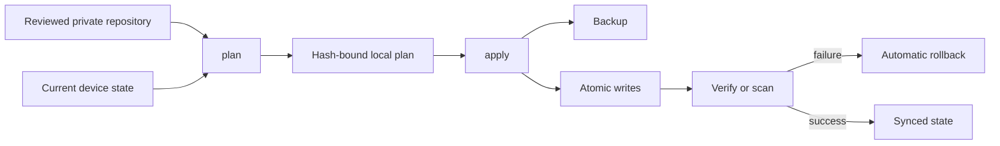

# Codex Config Sync

[](https://github.com/BakinSan7/codex-config-sync/actions/workflows/validate.yml)
[](https://www.python.org/)
[](#requirements)
[](LICENSE)

**Safely sync a reviewed subset of your Codex `AGENTS.md`, personal skills, custom agents, portable memory, and selected `config.toml` values across Windows and macOS.**

[Русская версия](README.ru.md)

> [!IMPORTANT]
> This is an unofficial community project. It is not affiliated with or endorsed by OpenAI.

## Why this exists

Copying the entire `~/.codex` directory is unsafe. It can mix credentials, local permissions, project trust, plugin state, caches, device paths, UI settings, and conversation history between machines.

Codex Config Sync uses a smaller, explicit surface:

- a strict manifest of files and owned skills;
- separate `common`, `windows`, and `macos` profiles;
- an empty-by-default allowlist for portable `config.toml` values;
- a mandatory two-step `plan` → `apply` workflow;
- content hashes that invalidate a plan after any source or target change;
- backups, atomic writes, post-write verification, and rollback;
- rejection of path traversal, symlinks, Windows junctions, and reparse points;
- a repository scanner for common credentials, private keys, and unsafe files, run during
  `plan` and again immediately before `apply`.

It never commits, pushes, downloads third-party skills, copies authentication state, or changes operating-system permissions for you.

## Requirements

- Windows 10/11 with PowerShell, or a currently supported macOS release;
- Python 3.11 or newer;
- Git for cloning and synchronizing your private repository.

The core uses only the Python standard library. Codex itself is not required for isolated tests, but it is required to verify real instruction and skill discovery after installation.

## Quick start

### 1. Create your private configuration repository

Use **Use this template** on GitHub, choose **Create a new repository**, and make that new repository **private**. Do not store your personal configuration in a public fork.

Clone your private repository and enter it:

```text
git clone https://github.com/<your-account>/<your-private-config-repo>.git
cd <your-private-config-repo>
```

Requirements: Git and Python 3.11 or newer.

### 2. Import the reviewed configuration from your first machine

Windows PowerShell:

```powershell
.\codex-sync.ps1 doctor
.\codex-sync.ps1 plan --direction from-device --show-diff
.\codex-sync.ps1 apply
.\codex-sync.ps1 scan
git diff
```

macOS:

```bash
./codex-sync.sh doctor
./codex-sync.sh plan --direction from-device --show-diff
./codex-sync.sh apply
./codex-sync.sh scan
git diff
```

Review the diff before you commit it. The tool deliberately does not run `git add`, `commit`, or `push`.

### 3. Apply it on the second machine

Pull or clone your private repository, then review and apply the opposite direction:

```powershell
# Windows
.\codex-sync.ps1 plan --direction to-device --show-diff
.\codex-sync.ps1 apply
.\codex-sync.ps1 verify
```

```bash
# macOS
./codex-sync.sh plan --direction to-device --show-diff
./codex-sync.sh apply
./codex-sync.sh verify
```

If either the repository or the local target changes after planning, `apply` refuses to continue. Run `plan` again and review the new diff.

## What gets synchronized

| Surface | Default | How to opt in |
| --- | --- | --- |
| Global `AGENTS.md` | Included example | Edit `portable/AGENTS.md` |
| Portable memory note | Included example | Edit `portable/portable-memory.md` |
| Personal skills you own | Empty | Add a directory and list it in the manifest |
| Custom agent TOML files | Empty | Add a file and list it in the manifest |
| Stable `config.toml` values | Empty | Add reviewed keys to `config/*.json` |
| OS-specific content | Empty | Use the `windows` or `macos` manifest profile |

See [Configuration](docs/CONFIGURATION.md) for examples.

## What stays local

- reasoning effort and model availability;
- font sizes, window layout, hotkeys, and notifications;
- sandbox mode, approval policy, network access, and OS permissions;
- project trust and absolute project paths;
- plugin IDs, plugin cache, OAuth, and connector authorization;
- MCP commands, environment variables, credentials, and local runtime paths;
- `auth.json`, tokens, cookies, SSH keys, and password-manager data;
- chats, sessions, generated memory, logs, caches, backups, and attachments;
- third-party skills and their executable dependencies.

These boundaries are enforced for known sensitive `config.toml` sections, not merely documented. See [Portability policy](docs/PORTABILITY.md).

## Safety flow



The plan file and backups are local and ignored by Git. A plan contains paths and hashes, not file contents.

## Commands

| Command | Purpose | Writes data |
| --- | --- | --- |
| `doctor` | Validate requirements, manifests, config profiles, and repository safety | No |
| `plan --direction from-device` | Safety-scan and preview local → repository changes, then bind them to hashes | Local ignored plan only |
| `plan --direction to-device` | Safety-scan and preview repository → local changes, then bind them to hashes | Local ignored plan only |
| `apply` | Apply the last unchanged plan, create a backup, and verify | Yes |
| `verify` | Compare managed repository content with the current device | No |
| `scan` | Detect common secrets, private keys, unsafe files, and links | No |
| `rollback --backup <path>` | Restore an unchanged post-apply state from a specific backup | Yes |

Add `--json` for machine-readable results. Add `--public-audit` to `doctor` or `scan` when checking a public template for user-specific absolute paths.

## Important limitations

- The tool does not perform a semantic merge. It shows a diff and requires a new plan after you edit either side.
- Managed trees are additive: extra destination files are not deleted automatically.
- The scanner is defense in depth, not proof that a repository contains no private information.
- The threat model does not protect against a malicious local administrator racing filesystem operations during `apply`.
- Codex configuration evolves. Review the current official documentation before adding new keys.

## Documentation

- [Configuration](docs/CONFIGURATION.md)
- [Migrating two existing machines](docs/MIGRATION.md)
- [Portability policy](docs/PORTABILITY.md)
- [Security model](docs/SECURITY_MODEL.md)
- [Troubleshooting](docs/TROUBLESHOOTING.md)
- [Prior art and licensing](docs/PRIOR_ART.md)
- [Contributing](CONTRIBUTING.md)
- [Security policy](SECURITY.md)

Codex configuration surfaces are documented by OpenAI in the [`config.toml` reference](https://learn.chatgpt.com/docs/config-file/config-reference), [`AGENTS.md` guide](https://learn.chatgpt.com/docs/agent-configuration/agents-md), and [skills documentation](https://learn.chatgpt.com/docs/skills-and-plugins).

## License

[MIT](LICENSE) © 2026 BakinSan7.
